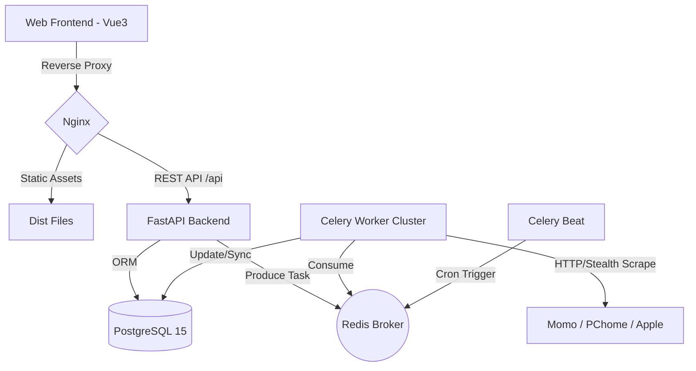

# 📊 iPhone Price Tracker Pro (Refined)

**iPhone Price Tracker Pro** 是一個針對 iPhone 設計的企業級自動化比價與價格監測系統。透過分散式爬蟲技術與多層級數據建模，協助使用者在混亂的電商價格中鎖定最佳購買時機。

---

## 🏗️ 系統架構 (System Architecture)

本系統採用 **Event-Driven & Microservices** 概念設計，確保 API 效能不因高負載爬蟲任務而下降。

### 數據流與架構圖



---

## 🛠️ 技術棧深度解析 (Tech Stack)

- **前端**: Vue 3 (Composition API) + Tailwind CSS + Chart.js (價格視覺化)
- **後端**: FastAPI + SQLAlchemy 2.0 (支援 Async 模式)
- **非同步處理**: Celery 5.x + Redis (具備 Task 冪等性設計)
- **資料模型**: 基於 Normalization (3NF)，區分 `ProductModel` (型號規格) 與 `Product` (平台實體)
- **基礎設施**: Docker Compose 封裝，實現 Infrastructure as Code (IaC) 快速部署

---

## 🚀 快速啟動指南 (Quick Start)

### 1. 環境預熱

```bash
git clone https://github.com/BpsEason/iphone-price-tracker-pro.git
cd iphone-price-tracker
cp .env.example .env  # 修改 POSTGRES_PASSWORD 與 JWT_SECRET
```

### 2. 容器化編排

```bash
docker-compose up -d --build
```

> **架構師提示**：啟動後，`backend` 容器會自動執行 Alembic Migration 與 `seed.py` 初始化基本型號數據。

### 3. 開發者入口

- **前端介面**: `http://localhost:8888`
- **API 文件 (Swagger UI)**: `http://localhost:8888/api/docs`
- **任務監控 (Flower)**: `http://localhost:5555` (選配，用於監控 Celery 隊列)

---

## ✨ 專案技術亮點 (Technical Highlights)

- **多階段構建 (Multi-stage Build)**：前端利用 Node 編譯，最終僅將 `dist` 靜態檔部署於輕量化 Nginx 鏡像中，提升部署速度並減少攻擊面。
- **時區一致性**：後端與資料庫鎖定 `Asia/Taipei`，避免跨日統計偏差。
- **資料庫優化**：
  - UPSERT (ON CONFLICT) 確保數據完整性
  - 複合索引 (`product_id`, `recorded_at`) 保持查詢高效
- **安全性設計**：JWT 狀態無關驗證，保障收藏與提醒功能的隱私安全。

---

## 📈 營運與自動化亮點 (Operational Highlights)

### 1. 分散式任務排程 (Precision Scheduling)

- **Celery Beat 定時觸發**：系統不僅能手動觸發爬蟲，更透過 Celery Beat 實現每小時自動校準。針對電商價格波動劇烈的時段（如午夜 00:00），排程任務能精準捕捉第一手降價資訊。
- **負載平衡與擴展性**：爬蟲任務被派發至 Redis 隊列，支援多個 Worker 節點並行處理。即使未來擴展至數萬個 SKU，也只需增加 Worker 容器即可實現線性擴展。

### 2. 結構化日誌管理 (Structured Logging)

- **集中式日誌追蹤**：全系統整合 Python `logging` 模組，對 API 請求與爬蟲進度進行等級化記錄（INFO/ERROR）。
- **爬蟲行為追蹤**：針對每一個爬蟲 Request，日誌皆詳細記錄「目標平台」、「響應耗時」與「解析狀態」。當電商改版導致解析失敗時，開發者能透過日誌瞬間鎖定損壞的 Selector 路徑。
- **Docker Logs 聚合**：透過 Docker 容器化管理，可輕鬆使用 `docker logs -f` 實時監控各服務狀態，或對接 ELK Stack 進行視覺化分析。

---

## 🏗️ 設計哲學與架構決策 (Design Philosophy & Decisions)

- **FastAPI**：選擇它是因為原生支援 async、型別安全、Pydantic 驗證，適合高併發 I/O bound 系統。
- **Celery + Redis**：任務解耦，避免 API 被爬蟲任務阻塞。
- **PostgreSQL**：支援 JSONB 與事務一致性，適合結構化與半結構化資料。
- **Vue3 前端**：快速開發、響應式數據綁定，搭配 Chart.js 提供直觀的價格趨勢視覺化。
- **Docker Compose**：確保 Dev-Prod Parity，新進開發者可快速搭建一致環境。

---

## 📅 未來路線圖 (Roadmap)

- [ ] **反爬蟲對抗**：整合 Playwright Stealth 繞過 TLS 指紋檢測
- [ ] **智慧預測**：導入 Prophet 模型，預測促銷期間降價可能性
- [ ] **即時通知**：支援 WebSocket 推送與 Telegram Bot 通知
- [ ] **使用者系統**：支援個人化收藏與提醒設定

---
